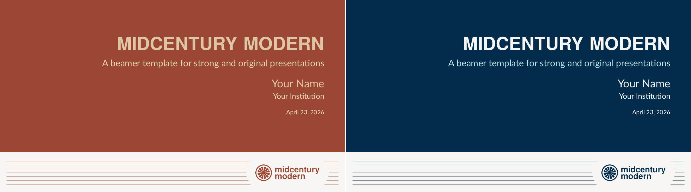
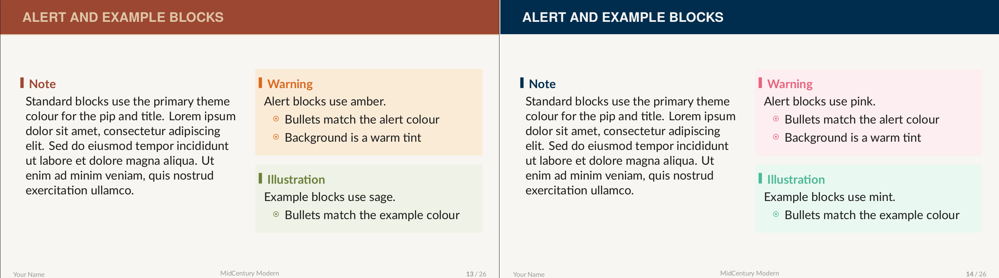
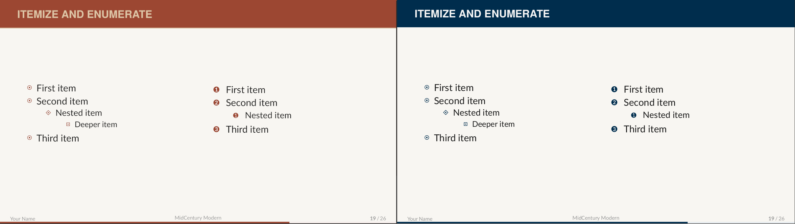
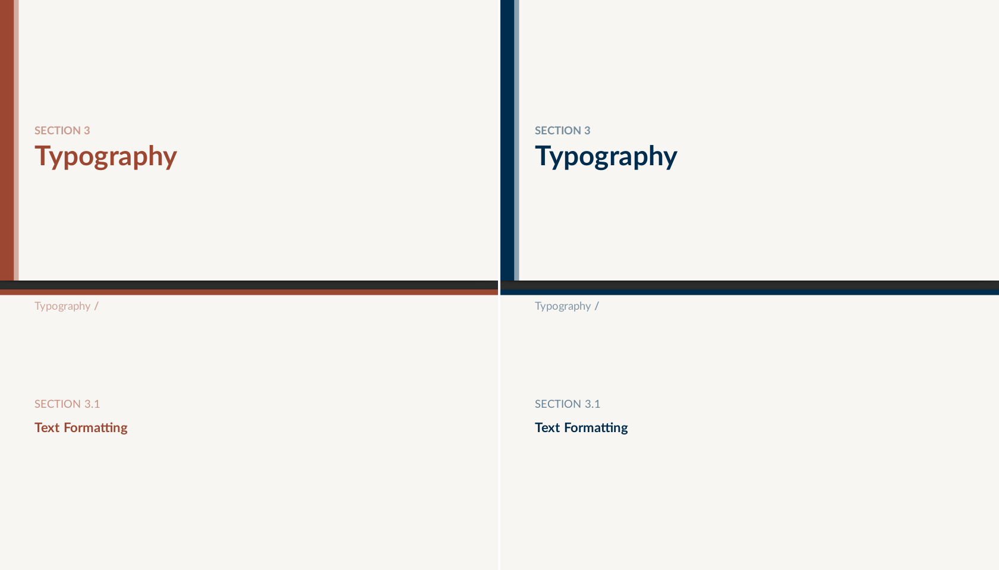

# Midcenturymodern — a retro-inspired Beamer template


<div align="center">

</div>

**Midcenturymodern** is a modern Beamer template with a retro feel. It requires LuaLaTeX.


## Two built-in themes

The template ships with two colour themes. **Kraft** leans warm, with terracotta and kraft paper tones. **DeepBlue** goes in the opposite direction, with a dark navy background and icy blue accents.

Select a theme in your preamble:

```latex
\usepackage{beamerthememidcenturymodern}
\mcmTheme{Kraft}      % warm terracotta palette
% \mcmTheme{DeepBlue} % dark navy palette
```


*Title slide — Kraft on the left, DeepBlue on the right.*

## A look at the slides

The theme supports standard, alert, and example blocks, each with a coloured accent that adapts to the active theme.


*Alert and example blocks — Kraft on the left, DeepBlue on the right.*

Lists use custom geometric markers at every nesting level.


*Itemize and enumerate — Kraft on the left, DeepBlue on the right.*

Section and subsection pages give the audience a clear visual indication of where they are in the talk.


*Section page — Kraft on the left, DeepBlue on the right.*

The full demo slides [can be found here](demo.pdf).

## Getting started

Clone the repository and place `beamerthememidcenturymodern.sty` in the same directory as your `.tex` file, then:

```latex
\documentclass[aspectratio=169]{beamer}
\usepackage{beamerthememidcenturymodern}
\mcmTheme{Kraft}

\title{Your Title}
\author{Your Name}
\institute{Your Institution}
\date{\today}

\begin{document}
\begin{frame}
  \titlepage
\end{frame}
\end{document}
```

Compile with LuaLaTeX.

## Availability

The theme is also available in the [Overleaf gallery](#).

## Feedback

Bug reports, suggestions, and pull requests are very welcome.