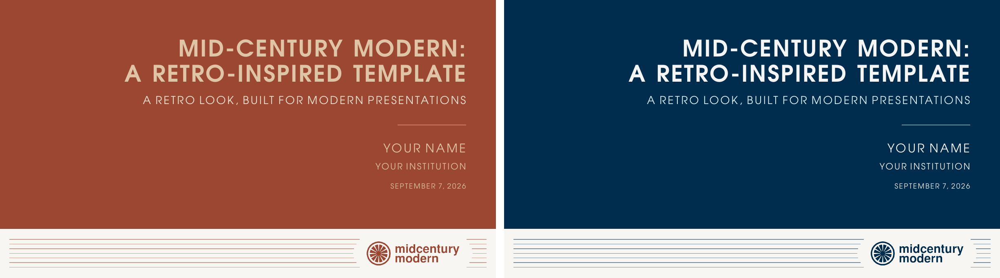
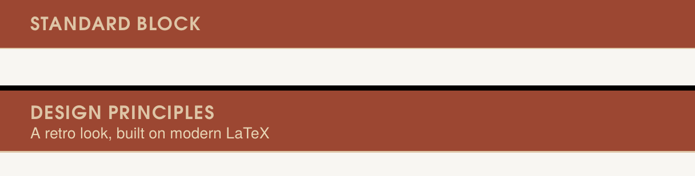
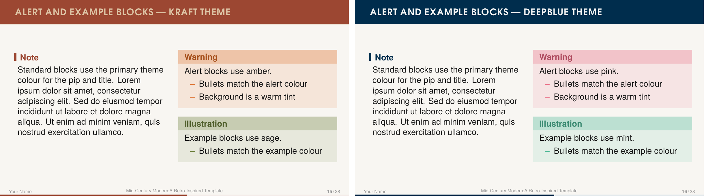
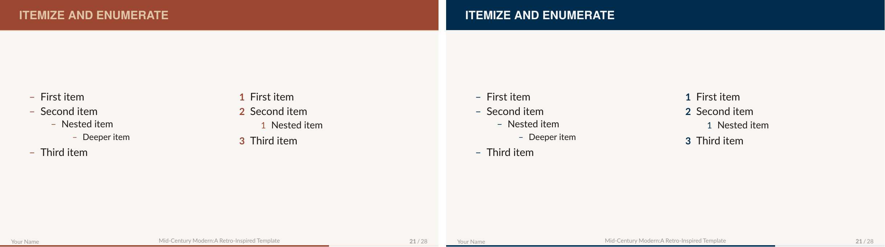
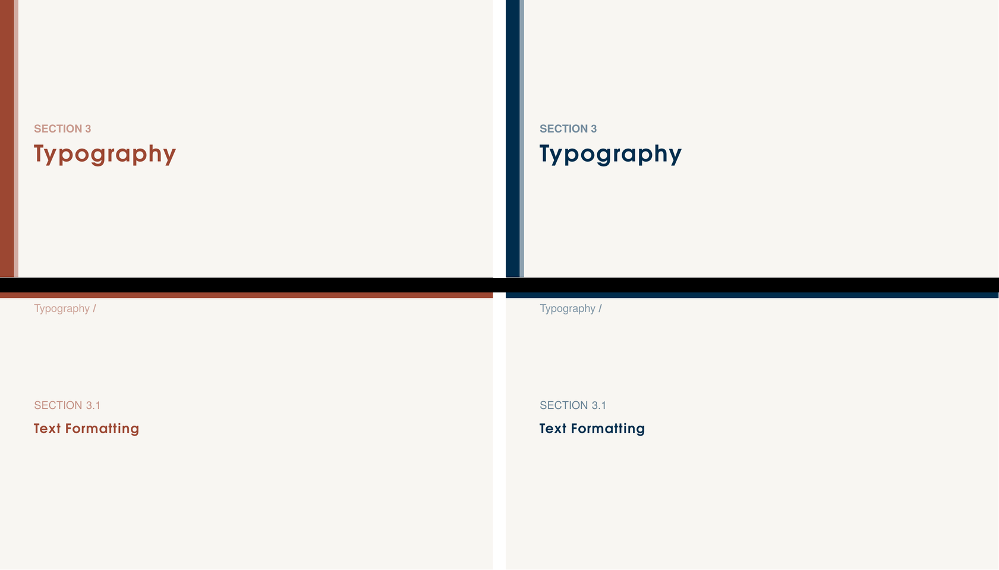

# MID-CENTURY MODERN


<div align="center">

</div>

**Mid-Century Modern** is a Beamer template with a retro feel. It requires LuaLaTeX.

Open it in [the Overleaf gallery](https://www.overleaf.com/latex/templates/midcenturymodern-beamer-theme/zdvwhytpqvgf) to start from a working project without installing anything, or clone this repository (see [Getting started](#getting-started)).


## Two built-in themes

The template ships with two colour themes. **Kraft** leans warm, with terracotta and kraft paper tones. **DeepBlue** goes in the opposite direction, with a dark navy background and icy blue accents.

Select a theme in your preamble:

```latex
\usepackage{beamerthememidcenturymodern}
\mcmTheme{Kraft}      % warm terracotta palette
% \mcmTheme{DeepBlue} % dark navy palette
```


*Title slide — Kraft on the left, DeepBlue on the right.*

## A look at the slides

Every frame title sits in a coloured band, and can carry a subtitle on a second line. The band opens by 3 mm to take it, not by a whole line.


*The band with a title alone, and with a title and a subtitle.*

The theme supports standard, alert, and example blocks, each with a coloured accent that adapts to the active theme.


*Alert and example blocks — Kraft on the left, DeepBlue on the right.*

Lists are marked with the running font's own en dash at every nesting level, so the mark follows the size and weight of the text it belongs to.


*Itemize and enumerate — Kraft on the left, DeepBlue on the right.*

Section and subsection pages give the audience a clear visual indication of where they are in the talk.


*Section page — Kraft on the left, DeepBlue on the right.*

The full demo slides [are available here](demo.pdf).

## Getting started

Clone the repository and place `beamerthememidcenturymodern.sty` in the same directory as your `.tex` file, then:

```latex
\documentclass[aspectratio=169]{beamer}
\usepackage{beamerthememidcenturymodern}
\mcmTheme{Kraft}

\title{Your Title}
\author{Your Name}
\institute{Your Institution}
\date{\today}
\titlegraphic{\includegraphics[height=0.8cm]{your-logo.pdf}}

\begin{document}
\begin{frame}
  \titlepage
\end{frame}
\end{document}
```

Compile with LuaLaTeX.

The logo on the title page is your own: set it with `\titlegraphic`, giving it a height rather than a width — the footer strip is built around the logo's height. Leave it out and the scan lines run the full width of the strip.

## Feedback

Bug reports, suggestions, and pull requests are very welcome.